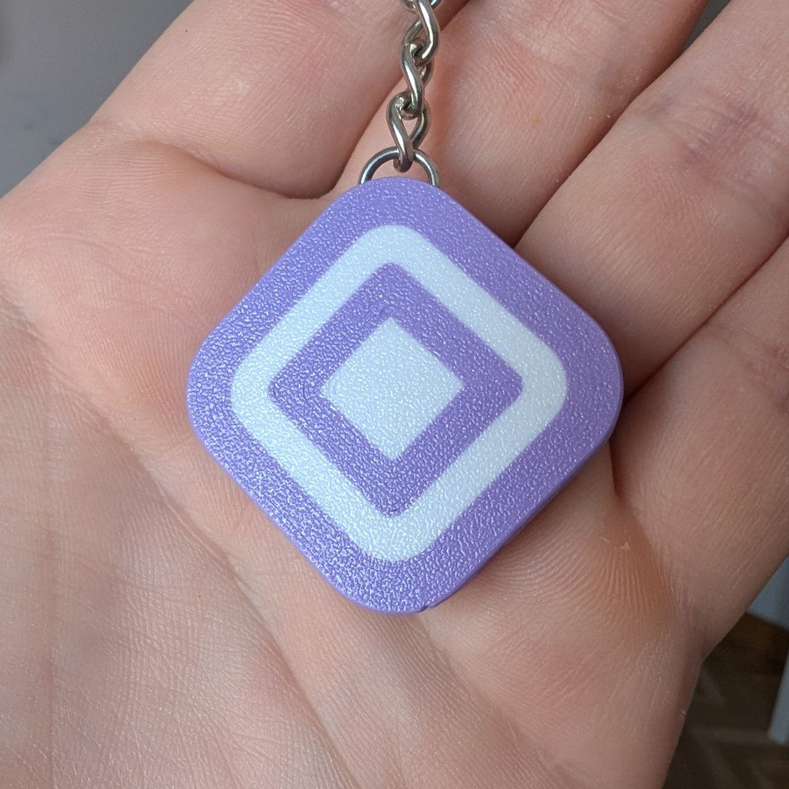
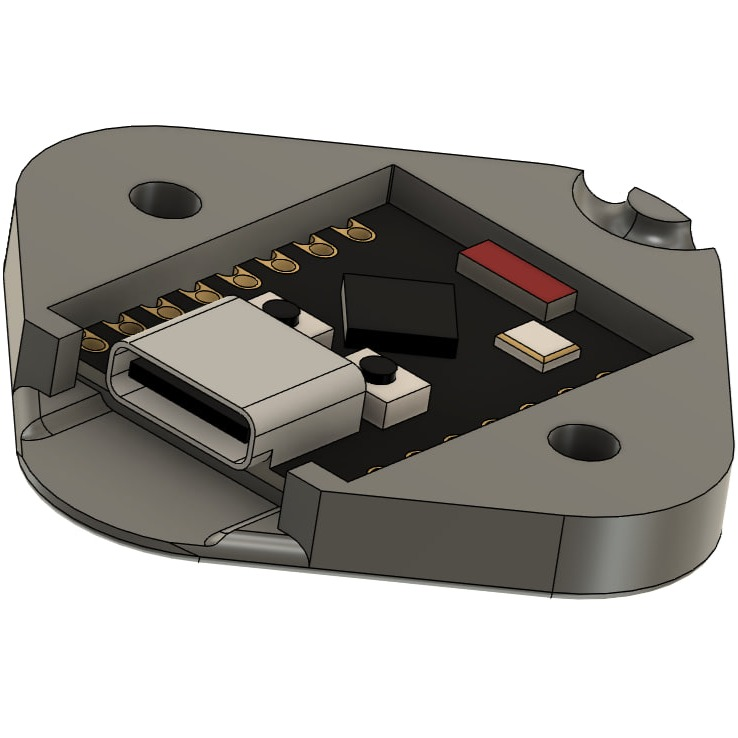

# Aztec keychain

## What

Low cost DIY hardware wallet for the Aztec network. This project should NOT be considered as a reference from a security standpoint, as it is a testbed for understanding how hardware wallets for Aztec could be designed and implemented.

## How

Based around the inexpensive ESP32 C3 chipset, in particular the Supermini boards available from plenty of [sources](https://es.aliexpress.com/item/1005007539612437.html?spm=a2g0o.order_list.order_list_main.5.6f47194dtnEeCs&gatewayAdapt=glo2esp).

- The wallet creates its own WiFi network with a captive portal when connected via USB.
- The captive portal can be accessed with an auxiliary device (such a smartphone) to operate the interface, configure it and authorize/sign transactions.
- The wallet exposes a serial interface to interact with applications.
- Accounts are generated locally in the device and private signing keys are NEVER exposed through WiFi or serial.
