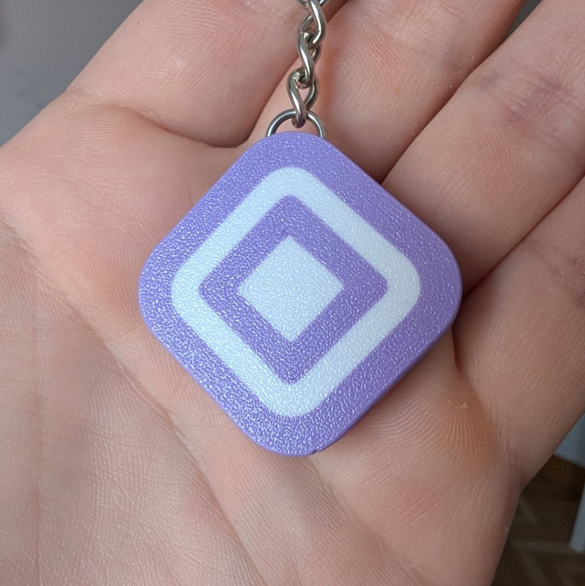

# Ordering

Only a single PCB is required: an [ESP32-C3 Supermini](https://es.aliexpress.com/item/1005007539612437.html?spm=a2g0o.order_list.order_list_main.5.6f47194dtnEeCs&gatewayAdapt=glo2esp). 

Other boards will probably work, but only this variant has been tested and currently the firmware is only built for it.

The case is closed with [M3x8mm countersunk screws](https://es.aliexpress.com/item/32800975883.html?spm=a2g0o.order_list.order_list_main.50.67c5194dOTiBPa&gatewayAdapt=glo2esp)
These screw [into M3xL3xOD4.5 brass inserts](https://es.aliexpress.com/item/1005006071488810.html?spm=a2g0o.order_list.order_list_main.149.67c5194dOTiBPa&gatewayAdapt=glo2esp)

# Printing

Choose a case model from the cad folder. STL, STEP, F3D and 3MF files are provided.

It can be printed in PLA or PETG, at 0.2mm layer height. It's recommended to use 10% gyroid infill.

# Flashing

*DO NOT CLOSE THE CASE BEFORE THE FIRST FLASH*

The ESP32's flash comes completely empty from the factory, that means no bootloader. Do not connect it to the computer yet!

* Go to https://keychain.anothercoffeefor.me/ using a Chromium-based browser (required to use the WebSerial API) and press the big yellow button. 
* You will be prompted to select a serial port. At this pointk press the `boot` button *WHILE CONNECTING THE BOARD TO THE COMPUTER*. Once it boots (red LED), you can stop pressing it. The port should appear and you can select it, allowing the browser access.
* Click on "Install aztec-keychain" to load the firmware. It is not necessary to erase the device.

